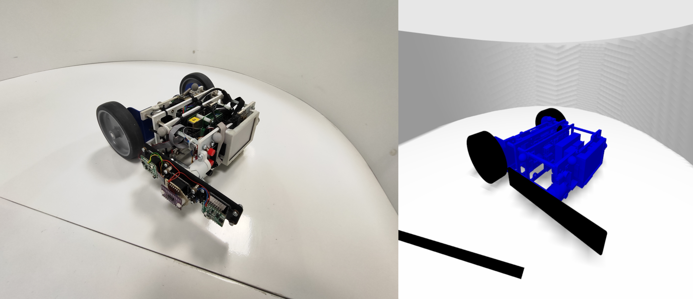
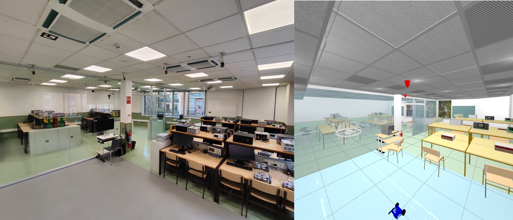
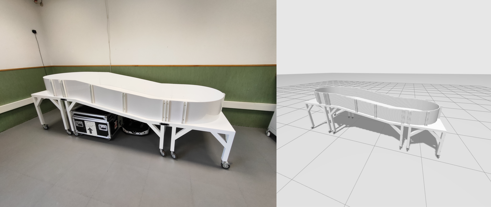

# icai_crl_description
This package contains SDFormat environment and robot models of ICAI's Control and Robotics Laboratory. Compatible with Gazebo Fortress (SDFormat 1.9).

## Installation

```bash
# Clone into your ROS2 workspace
cd ~/ros2_ws/src
git clone https://github.com/diegocubillo/icai_crl_description.git

# Build the package
cd ~/ros2_ws
colcon build --packages-select icai_crl_description
source install/setup.bash
```

## Usage

### In Gazebo Launch Files
```xml
<include>
  <uri>package://icai_crl_description/models/robots/kitt</uri>
</include>
```

### In SDF World Files
```xml
<include>
  <uri>model://control_lab</uri>
</include>
```

## Models
### Robots
- **kitt**: Base wheeled vehicle with differential drive
- **kitt_nav**: Kitt with navigation sensors (LiDAR)
- **kitt_segway**: Kitt configured as balancing vehicle

### Environments
- **control_lab**: Complete laboratory with lighting
- **control_lab_lite**: Laboratory without lights (performance optimized)
- **ramp_circuit**: Competition robot track
- **support_wall**: Support for balancing vehicle startup


### Pictures
`kitt` model:



`control_lab` model:



`ramp_circuit` model:


## License

Apache 2.0

## Authors

Diego Cubillo (dcubillo@comillas.edu)